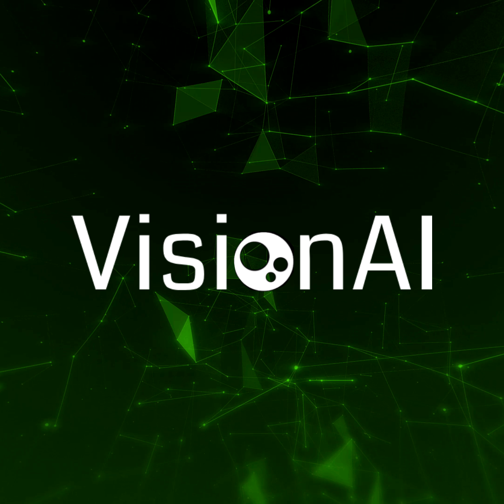

# 
VisionAI - GenAI Genesis 2024 Project

Empowering Visual Independence with Artificial Intelligence. VisionAI is a camera application that identifies everyday objects and recognizes preset hand gestures for various command executions.

<b>Team Name:</b> CODE BLOODED

<b>Team Members:</b>
  Avaninder Bath - https://www.linkedin.com/in/avaninderbath/
  Julia Da Silva - https://www.linkedin.com/in/juliapereiradasilva/
  Daniel DeBrun - https://www.linkedin.com/in/danieldebrun/
  Luana Madeira - https://www.linkedin.com/in/luanamadeira/

## How To Start The Application
- For demonstration purposes, install NPM, Google CLI (for the API key to work), Python 3.9.0, and PIP 24.0.
- To run the demonstration, type ``npm i`` in a command window to install dependencies in the ``front`` directory, and then type ``npm start`` to open the application.
- For any use case, the only prerequisite is an Android OS version 5.0 or later smart device. Laptops and desktop computers also work.
- Enjoy!
